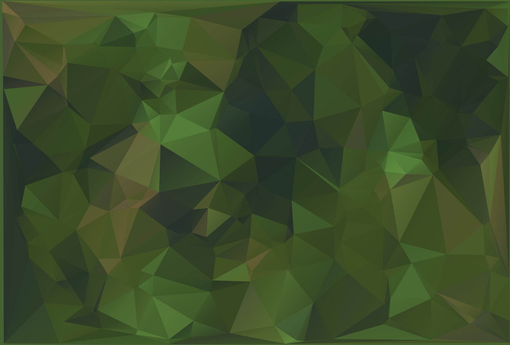

# LinkArmory - Tactical Excellence 🚀&#10;&#10;&#10;&#10;**Professional-grade military and tactical equipment e-commerce website.** Serving defense professionals, law enforcement, and authorized civilians with precision-engineered gear like drones, controllers, sensors, and more.&#10;&#10;## 📖 About&#10;LinkArmory provides military-grade equipment built for reliability and performance in demanding environments. Features certified quality, free shipping (orders over ₹5000), secure payments, 24/7 support, and easy returns.&#10;&#10;## 🛠️ Tech Stack&#10;- **Frontend**: HTML5, CSS3, Vanilla JavaScript&#10;- **Data**: JSON (products.json)&#10;- **Features**: Responsive design, product catalog, shopping cart, search, order management&#10;&#10;## 🚀 Quick Start&#10;1. Clone or open the project folder.&#10;2. Double-click `index.html` to launch in your default browser (no server required).&#10;3. Browse products, add to cart, proceed to checkout.&#10;&#10;**Live Demo**: `start index.html` (Windows)&#10;&#10;## 📁 Project Structure&#10;```&#10;.&#10;├── index.html          # Home page with featured products&#10;├── Products.html       # Full product catalog&#10;├── About.html          # Company info&#10;├── Login.html          # User login&#10;├── Orders.html         # Order history&#10;├── CheckOut.html       # Checkout process&#10;├── Contact.html        # Contact page&#10;├── products.json       # 21+ tactical products (drones, motors, sensors, etc.)&#10;├── nav.js              # Navigation & search&#10;├── products.js         # Product loading & display&#10;├── addToCart.js        # Cart functionality&#10;├── styles.css          # Global styles&#10;├── utility.css         # Utility classes&#10;└── assets/             # Images, icons, product photos&#10;```&#10;&#10;## ✨ Key Features&#10;- **Product Catalog**: Dynamic loading from JSON with images, ratings, prices, discounts.&#10;- **Shopping Cart**: Add/remove items, quantity controls, total calculation.&#10;- **Responsive Nav**: Desktop/mobile menus, search bar.&#10;- **Pages**: Home, Products, Orders, Checkout, Login, About, Contact.&#10;- **UI/UX**: Modern tactical theme, hover effects, cart sidebar.&#10;&#10;## 📱 Screenshots&#10; <!-- Replace with actual screenshot path if added -->&#10;&#10;## 🔮 Future Enhancements&#10;- Backend integration (Node.js/Express, database).&#10;- User authentication & persistence (localStorage/Firebase).&#10;- Payment gateway (Razorpay/Stripe).&#10;- Filters/sorting for products.&#10;- Deployment (Vercel/Netlify).&#10;&#10;## 🤝 Contributing&#10;1. Fork the repo.&#10;2. Create a feature branch.&#10;3. Commit changes.&#10;4. Open a Pull Request.&#10;&#10;## 📄 License&#10;MIT License - feel free to use and modify.&#10;&#10;&copy; 2025 LinkArmory. All rights reserved.&#10;&#10;**Trusted by Professionals | Built for Precision**
